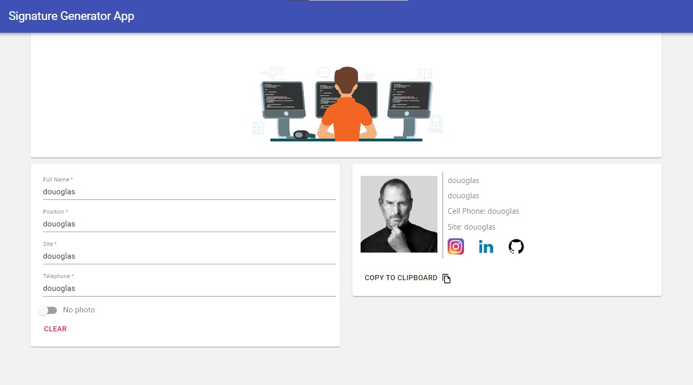
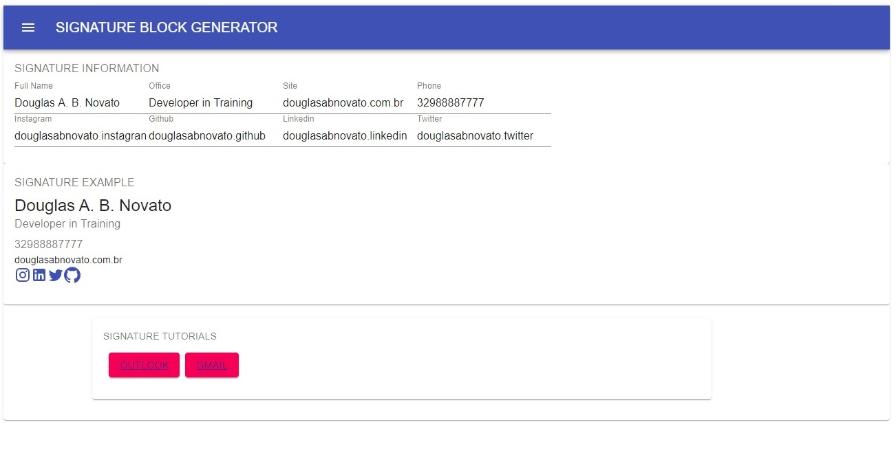
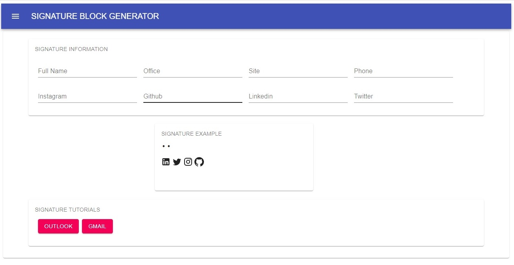
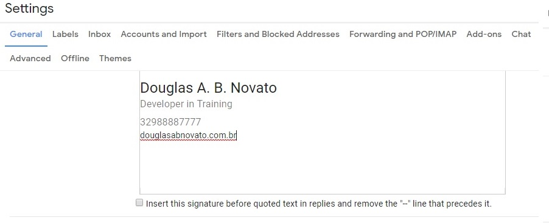
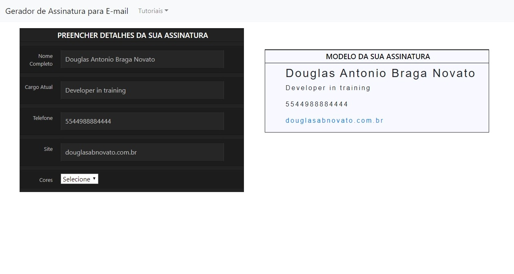

<h4 align="center"> 
	🚧 Signature Generator App 🚀
</h4> 

<h1 align="center">
    
</h1>

### 💻 Sobre o projeto

♻️ Signature Generator App 

Uma aplicação que oferece um formulário para ser preenchido e assim, construir um modelo de assinatura para ser inserido no e-mail. 
 
#### 🎨 Layout

Uma aplicação web responsiva desenvolvida em reactjs com material design lite do Google. 

#### Próximo passo

- [ ] Hospedar aplicação: Netlify
- [ ] Eficiência da assinatura
- [ ] Aperfeiçar responsividade com material-ui
- [x] Limpar design

#### Web - v3.1

- implementar as funcionalidades descritivas no projects board com as issues e fazer a atualização na master das branches com pull requests.

<p align="center" style="display: flex; align-items: flex-start; justify-content: center;">
  
  
</p>

#### Web - v2.0

- Avançado design para uma estilização mais moderna.

<p align="center" style="display: flex; align-items: flex-start; justify-content: center;">
  
  
</p>

#### Web - v1.0

- um layout simples, preto e branco.

<p align="center" style="display: flex; align-items: flex-start; justify-content: center;">
  
  
</p>

### 🛠 Tecnologias

As seguintes ferramentas foram usadas na construção do projeto:

- SPA
- html css javascript
- material-ui
- typescript
- [Yarn][yarn]
- [Node.js][nodejs]
- [React][reactjs]
- [Git][git]
- [Github][github]

#### Pré-requisitos

Antes de começar, você vai precisar ter instalado em sua máquina as seguintes ferramentas:
[Git][git], [Node.js][nodejs]. 
Além disto é bom ter um editor para trabalhar com o código como [VSCode][vscode]

### 🧭 Rodando a aplicação web

```bash
# Clone este repositório
$ git clone https://github.com/douglasabnovato/signature-generator-app

# Instale as dependências
$ npm install

# Execute a aplicação em modo de desenvolvimento
$ npm run start

# A aplicação será aberta na porta:3000 - acesse http://localhost:3000
```

#### 😯 Como contribuir para o projeto

1. Faça um **fork** do projeto.
2. Crie uma nova branch com as suas alterações: `git checkout -b my-feature`
3. Salve as alterações e crie uma mensagem de commit contando o que você fez: `git commit -m "feature: My new feature"`
4. Envie as suas alterações: `git push origin my-feature`
> Caso tenha alguma dúvida confira este [guia de como contribuir no GitHub](https://github.com/firstcontributions/first-contributions)

#### 📝 Licença

Este projeto esta sobe a licença MIT.

---

Feito com ❤️ por <a href="https://www.linkedin.com/in/douglasabnovato/"></a>👋🏽

[git]: https://git-scm.com/doc
[github]: https://docs.github.com/en
[nodejs]: https://nodejs.org/
[reactjs]: https://reactjs.org
[yarn]: https://yarnpkg.com/
[vscode]: https://code.visualstudio.com/
