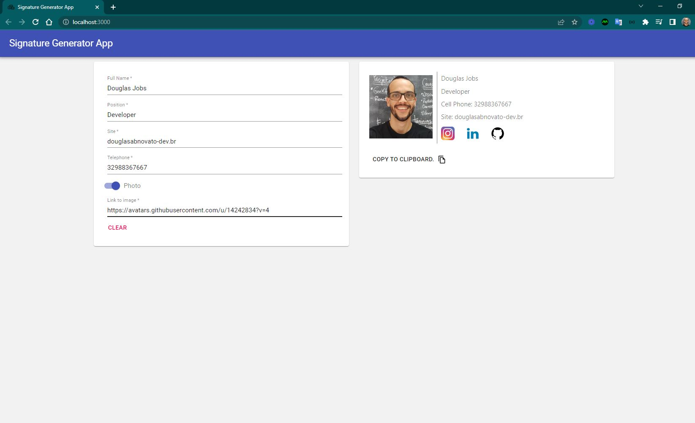
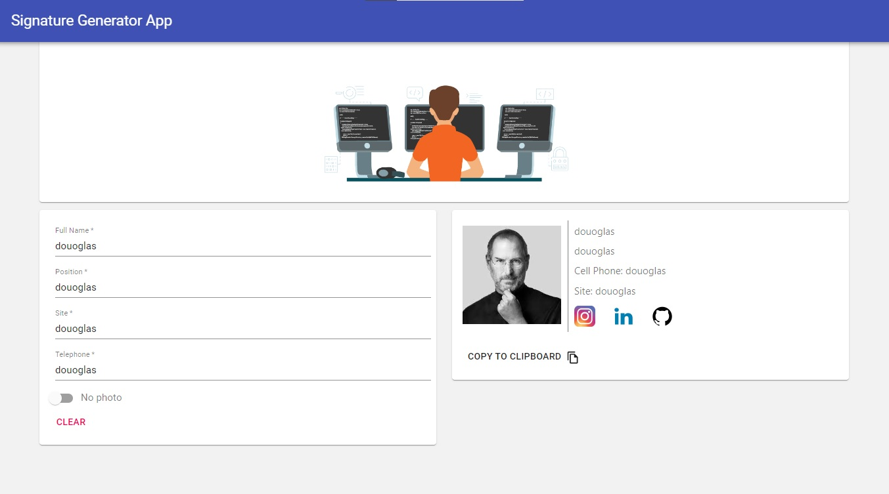
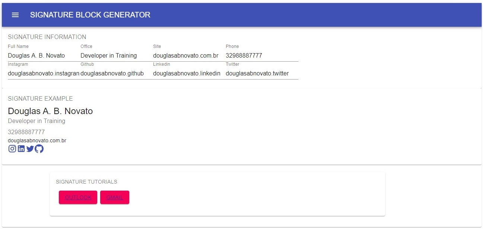
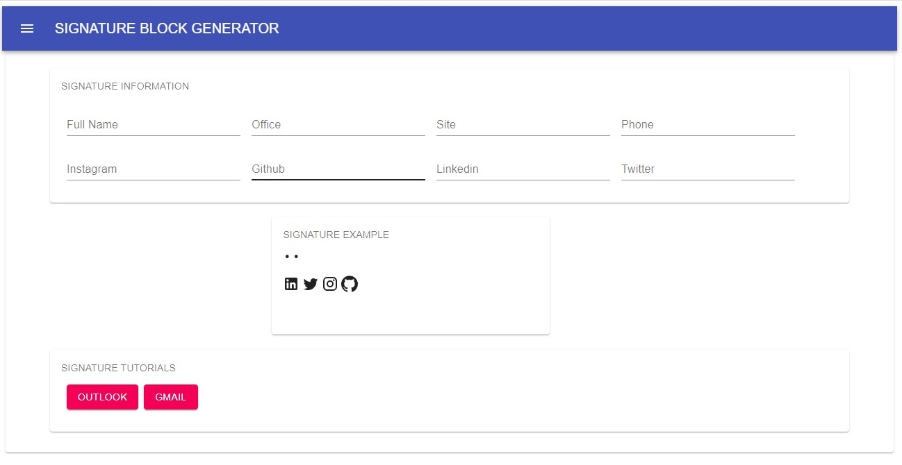
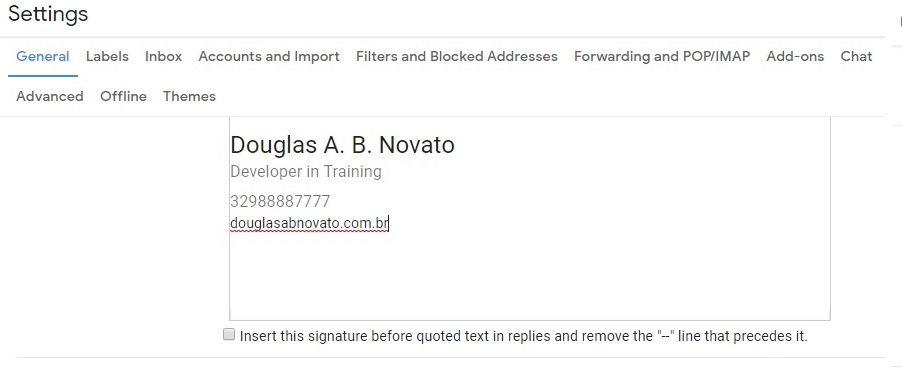
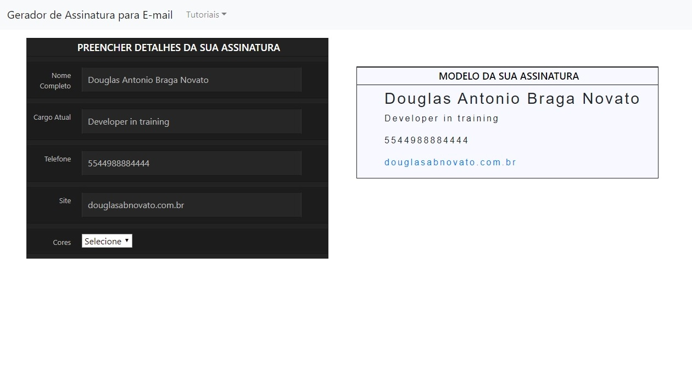

<h4 align="center"> 
	🚧 Signature Generator App 🚀
</h4> 

<h1 align="center">
    
</h1>

### 💻 Sobre o projeto

♻️ Signature Generator App 

Uma aplicação que oferece um formulário para ser preenchido e assim, construir um modelo de assinatura para ser inserido no e-mail. 
 
#### 🎨 Layout

Uma aplicação web responsiva desenvolvida em reactjs com material design lite do Google. 


#### Estrutura de Pastas

```text
SIGNATURE-GENERATOR/
├── .github/
│   └── refs/
│       ├── Main.png
│       ├── NoPhotoSignature.png
│       └── PhotoSignature.png
├── signature-generator-app-v3.0.jpg
├── signature-generator-app-v3.1-desktop.jpg
├── tela-1.jpg
├── tela-2.jpg
├── tela-3.jpg
├── tela-4.jpg
├── public/
├── src/
│   ├── assets/
│   ├── App.css
│   ├── App.tsx
│   ├── CircularProgressWithLabel.tsx
│   ├── index.css
│   ├── index.tsx
│   ├── react-app-env.d.ts
│   └── Signature.tsx
├── .gitignore
├── package.json
├── README.md
└── tsconfig.json
```


---


# Proposta de Funcionalidades e Requisitos: Signature Generator v4.0

## 🎯 1. Visão Geral da Funcionalidade Core
A aplicação deve permitir que profissionais criem assinaturas de e-mail limpas, padronizadas e compatíveis com os principais clientes de e-mail (Gmail, Outlook, Apple Mail), oferecendo preenchimento guiado e seleção visual de templates.

---

## 🚀 2. Funcionalidades Principais (Features)

### A. Painel de Dados do Usuário (Formulário Inteligente)
* **Informações Básicas:** Nome completo, cargo/função, empresa/departamento.
* **Contatos:** E-mail principal, telefone/celular, site da empresa.
* **Redes Sociais:** Links dinâmicos para LinkedIn, GitHub, Instagram, Twitter/X e YouTube (com ícones automáticos).
* **Upload/Avatar:** Inclusão de foto de perfil (com opção de recorte circular ou quadrado) ou opção de gerar a assinatura sem foto.

### B. Seletor de Templates (Cards de Rodapé)
* **Galeria de Modelos Visuais:** O usuário poderá escolher entre diferentes estilos de cards estruturados para o rodapé:
  * *Minimalista:* Foco em texto limpo com divisores sutis.
  * *Moderno com Foto:* Layout em duas colunas (Avatar à esquerda, dados e redes à direita).
  * *Corporativo/Compacto:* Otimizado para economizar espaço em comunicações corporativas diárias.
* **Personalização de Cores (Theming):** Escolha da cor de destaque da assinatura (barra lateral, ícones e links) combinando com a identidade visual da marca ou do usuário.

### C. Engine de Pré-visualização em Tempo Real (Live Preview)
* **Split-Screen Responsivo:** À medida que o usuário digita ou altera as opções, a assinatura se atualiza instantaneamente na tela.
* **Alternância de Fundo:** Botão para alternar o fundo da pré-visualização (Modo Claro / Modo Escuro) para testar o contraste real da assinatura.

### D. Exportação e Cópia Otimizada (Copy to Clipboard)
* **Cópia em HTML Formatado:** Botão "Copiar Assinatura" que injeta o código HTML limpo e inline na área de transferência, pronto para ser colado nas configurações de assinatura do Gmail ou Outlook sem perder a formatação.
* **Exportação de Código HTML:** Opção avançada para visualizar e copiar o código puro (caso o usuário queira customizar manualmente).

---

## 📐 3. Requisitos Técnicos e de Arquitetura

### Requisitos Funcionais (RF)
* **RF01:** O sistema deve validar os campos de e-mail e URLs de redes sociais antes de gerar o código final.
* **RF02:** O layout gerado deve utilizar tabelas HTML (`<table>`) aninhadas e estilos *inline* (padrão obrigatório para garantir compatibilidade de renderização em clientes de e-mail restritos como o Outlook).
* **RF03:** O sistema deve persistir temporariamente os dados preenchidos no `localStorage` do navegador para evitar perda de informações caso a página seja recarregada acidentalmente.

### Requisitos Não Funcionais (RNF)
* **RNF01 (Performance):** A renderização da pré-visualização não deve apresentar atrasos perceptíveis (*debounce* otimizado nos inputs).
* **RNF02 (Compatibilidade):** O código HTML gerado deve ser compatível com os principais Webmail e Clients (Gmail, Outlook Desktop/Web, Apple Mail).
* **RNF03 (Stack Moderna):** Migração estruturada para React moderno com TypeScript estrito, garantindo segurança de tipos para os dados da assinatura.

#### Web - v3.1

- revisando o design do projeto e identificando pontos de melhorias

<p align="center" style="display: flex; align-items: flex-start; justify-content: center;">
  
</p>

##### Próximo passo

- [ ] Hospedar aplicação
- [ ] Design nas transições
- [ ] Eficiência da assinatura
- [x] Limpar design

#### Web - v3.0

- implementar as funcionalidades descritivas no projects board com as issues e fazer a atualização na master das branches com pull requests.

<p align="center" style="display: flex; align-items: flex-start; justify-content: center;">
  
</p>

#### Web - v2.0

- Avançado design para uma estilização mais moderna.

<p align="center" style="display: flex; align-items: flex-start; justify-content: center;">
  
  
</p>

#### Web - v1.0

- um layout simples, preto e branco.

<p align="center" style="display: flex; align-items: flex-start; justify-content: center;">
  
  
</p>

### 🛠 Tecnologias

As seguintes ferramentas foram usadas na construção do projeto:

- SPA
- html css javascript
- material-ui
- typescript
- [Yarn][yarn]
- [Node.js][nodejs]
- [React][reactjs]
- [Git][git]
- [Github][github]

#### Pré-requisitos

Antes de começar, você vai precisar ter instalado em sua máquina as seguintes ferramentas:
[Git][git], [Node.js][nodejs]. 
Além disto é bom ter um editor para trabalhar com o código como [VSCode][vscode]

### 🧭 Rodando a aplicação web

```bash
# Clone este repositório
$ git clone https://github.com/douglasabnovato/signature-generator-app

# Instale as dependências
$ npm install

# Execute a aplicação em modo de desenvolvimento
$ npm run start

# A aplicação será aberta na porta:3000 - acesse http://localhost:3000
```

#### 😯 Como contribuir para o projeto

1. Faça um **fork** do projeto.
2. Crie uma nova branch com as suas alterações: `git checkout -b my-feature`
3. Salve as alterações e crie uma mensagem de commit contando o que você fez: `git commit -m "feature: My new feature"`
4. Envie as suas alterações: `git push origin my-feature`
> Caso tenha alguma dúvida confira este [guia de como contribuir no GitHub](https://github.com/firstcontributions/first-contributions)

#### 📝 Licença

Este projeto esta sobe a licença MIT.

---

Feito com ❤️ por <a href="https://www.linkedin.com/in/douglasabnovato/"></a>👋🏽

[git]: https://git-scm.com/doc
[github]: https://docs.github.com/en
[nodejs]: https://nodejs.org/
[reactjs]: https://reactjs.org
[yarn]: https://yarnpkg.com/
[vscode]: https://code.visualstudio.com/
